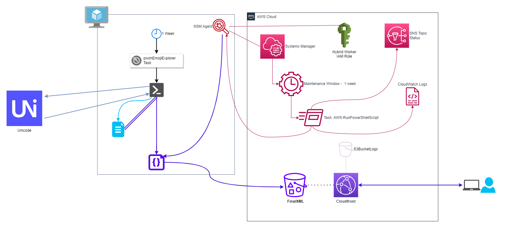

# pwshEmojiExplorer - Emoji Data Set creation component

## Synopsis

pwshEmojiExplorer uses a cloud-based, event driven workflow to generate a dynamic data set of emojis based on Public data set from the Unicode Data Files.

This workflow continuously checks for emoji version updates for Unicode and automatically updates the emoji data set used by pwshEmojiExplorer.

You can check out [pwshEmojiExplorer Metrics](pwshEmojiExplorer-Metrics.md) for metric insights into this process.

## Unicode Data Files Terms of Use

pwshEmojiExplorer uses the Public data set from the Unicode Data Files and adheres to the Unicode Terms of Use:

- [Unicode® Copyright and Terms of Use](https://www.unicode.org/copyright.html)
- [UNICODE LICENSE V3](https://www.unicode.org/license.txt)

## Design Diagram

